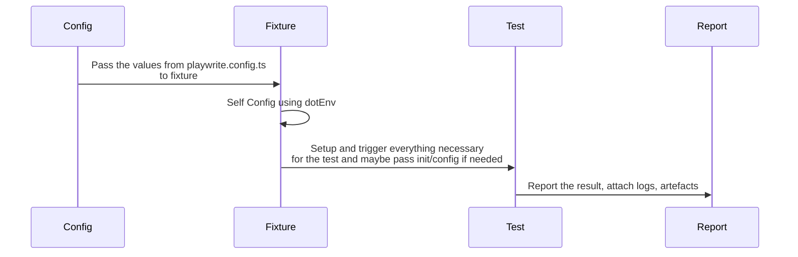

## Install

Install Playwright browsers   
```
yarn playwright install
```

Install Playwright operating system dependencies requires sudo / root 
```
sudo yarn playwright install-deps
```


## Runs
Runs the end-to-end tests.
```
yarn playwright test
```

Runs the tests only on Desktop Chrome.

```
yarn playwright test --project=localChromium
```

Runs the tests in debug mode.

```
yarn playwright test --debug
```

Runs the tests in a specific file.

```
yarn playwright test example
```

Starts the interactive UI mode. This also can be set in the config

```
yarn playwright test --ui
```

[More info on running tests](https://playwright.dev/docs/running-tests)


## Extra tooling

Auto generate tests with Codegen.

```yarn playwright codegen```


Allure report display needs JAVA_HOME set 
and to run the server JDK version 8 to 11 otherwise you get 
``` 
Starting web server...
Exception in thread "main" java.lang.UnsatisfiedLinkError: Can't load library: /usr/lib/jvm/java-17-openjdk-amd64/lib/libawt_xawt.so
at java.base/java.lang.ClassLoader.loadLibrary(ClassLoader.java:2398)
at java.base/java.lang.Runtime.load0(Runtime.java:755)
at java.base/java.lang.System.load(System.java:1970)
at java.base/jdk.internal.loader.NativeLibraries.load(Native Method) 
```
## Writing test
Currently, the flow once the run starts is provide some configuration based on playwrite.config.ts [test project](https://playwright.dev/docs/test-projects)
(project can be viewed as a way to parametrize the tests) to the [fixture](https://playwright.dev/docs/next/test-fixtures#introduction) of the test located in [fixtures folder](./fixtures).   
In the folder there is base a base fixture to start the browser that is required. Depending on the required steps you can do actions even before and after hooks in the tests. 
Good example is running services, browsers etc. From the fixture you can pass down test configuration or any other data required.
Once in the test the run follows any regular unit testing framework flow. 


Some more usefull links for playwright
https://playwright.dev/docs/locators#quick-guide 
https://playwright.dev/docs/api/class-electronapplication#electron-application-evaluate

## Running test
### Preconditions
For RedisApp for electron Appimage (path in  playwright.config,js) is required or change the path to the appropriate build folder on your machine
For docker testing you need to load the docker image for your system  (or run the app form your code base)
```shell
  docker load -i docker-linux-alpine.amd64.tar
  or
  docker load -i docker-linux-alpine.arm64.tar
```
and change the config in playwright.config,js.

For loading Redis databases and data similar to the other project you have [local-docker-environment](./local-docker-environment) folder. 
Fil the .env file similar to [the setup in conflunce ](https://redislabs.atlassian.net/wiki/spaces/DX/pages/4906319969/Mac+setup+e2e+tests) 
and execute
```shell
 ./local-docker-environment/create_local_environment.sh
```
to destroy the environment use 
```shell
 ./local-docker-environment/destroy_local_environment.sh
```


