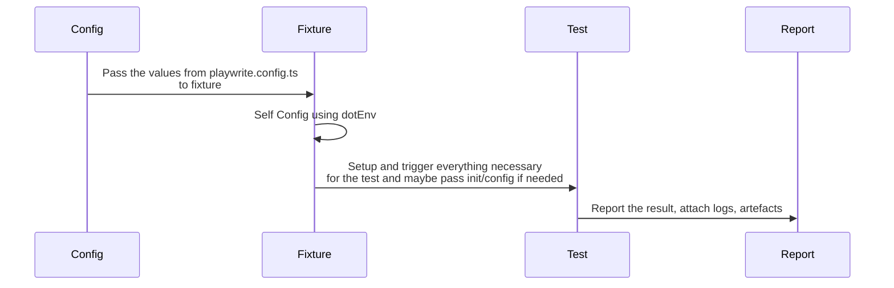

## Install


```shell
  yarn install
```

Install Playwright browsers   
```shell
  yarn playwright install
```

Install Playwright operating system dependencies requires sudo / root 
```shell
  sudo yarn playwright install-deps
```

[More info on running tests](https://playwright.dev/docs/running-tests)


## Extra tooling

Auto-generate tests with Codegen.

```shell
  yarn playwright codegen
```

Starts the interactive UI mode. This also can be set in the config.

```shell
  yarn playwright test --ui
```


Allure report display needs JAVA_HOME set  
and to run the server, JDK version 8 to 11 is required. Otherwise, you get:
``` 
Starting web server...
Exception in thread "main" java.lang.UnsatisfiedLinkError: Can't load library: /usr/lib/jvm/java-17-openjdk-amd64/lib/libawt_xawt.so
at java.base/java.lang.ClassLoader.loadLibrary(ClassLoader.java:2398)
at java.base/java.lang.Runtime.load0(Runtime.java:755)
at java.base/java.lang.System.load(System.java:1970)
at java.base/jdk.internal.loader.NativeLibraries.load(Native Method) 
```

However, running the report from a server or IDE also works, so it is up to you.

## Writing test
Currently, the flow once the run starts is: provide some configuration based on `playwright.config.ts` [test project](https://playwright.dev/docs/test-projects)  
(project can be viewed as a way to parametrize the tests) to the [fixture](https://playwright.dev/docs/next/test-fixtures#introduction) of the test located in the [fixtures folder](./fixtures).  
In the folder, there is a base fixture to start the browser that is required. Depending on the required steps, you can do actions even before and after hooks in the tests.  
A good example is running services, browsers, etc. From the fixture, you can pass down test configuration or any other data required.  
Once in the test, the run follows any regular unit testing framework flow.


Some more useful links for Playwright:  
https://playwright.dev/docs/locators#quick-guide 
https://playwright.dev/docs/api/class-electronapplication#electron-application-evaluate

## Running test
### Preconditions

For RedisApp for Electron, AppImage (path in `playwright.config.js`) is required or change the path to the appropriate build folder on your machine.  
For Docker testing, you need to load the Docker image for your system (or run the app from your code base):

```shell
  docker load -i docker-linux-alpine.amd64.tar
  or
  docker load -i docker-linux-alpine.arm64.tar
```
and change the config in playwright.config,js.

For loading Redis databases and data similar to the other project, you have the [local-docker-environment](./local-docker-environment) folder.  
Fill the `.env` file similar to [the setup in Confluence](https://redislabs.atlassian.net/wiki/spaces/DX/pages/4906319969/Mac+setup+e2e+tests)  
and execute:

```shell
 ./local-docker-environment/create_local_environment.sh
```

To destroy the environment use:
```shell
 ./local-docker-environment/destroy_local_environment.sh
```

## Runs

Runs the end-to-end tests (all projects):

``` shell
  yarn playwright test
```

Runs the tests only on Desktop Chrome.

```shell
  yarn test:chromium
```

To run Electron tests:

```shell
  yarn test:electron
```


Runs the tests in framework debug mode.

```
yarn playwright test --project=localChromium  --debug
```

Runs the tests in a specific file:

```shell
  yarn playwright test example
```

### Electron testing  

Tests and setup are quite similar to browser tests. In the Electron case, `baseURL` is the path on the local file system for a prebuilt/installed app  
or an AppImage. In my case, I used an AppImage for Linux, so the config was:

```json lines
use: {
                baseURL: '/home/tsvetan-tsvetkov/Downloads/Redis-Insight-linux-x86_64.AppImage',
                apiUrl: 'https://localhost:5530/api',
                headless: false,

            },
```

That section for macOS, where I used an installed app, looked like:

```json lines
use: {
                baseURL: '/Users/tsvetantsvetkov/Applications/RedisInsight.app/Contents/MacOS/Redis Insight',
                apiUrl: 'https://localhost:5530/api',
                headless: false,

            },
```
Execution-wise, there were no changes. An interesting project that I came across while investigating starting Electron issues  
is based on this blog post: [Testing Electron Apps with Playwright](https://dev.to/kubeshop/testing-electron-apps-with-playwright-3f89).  
The code base [is here](https://github.com/kubeshop/monokle/blob/main/tests/electronHelpers.ts).

They are using this helper for when a new build is created, starting the test automatically by finding the latest build,  
setting the correct paths, and running the tests. So it might be useful to have something similar implemented.

## Debug 

Add `DEBUG=pw:api` as an environment variable. This will enable the framework debug mode plus will enable log interceptors for the Axios client.

## Reports

Running:

```shell
  yarn test:chromium
```

will generate HTML and Allure reports. However, those reports are for a single run. In order to have history, which is more useful, run:

```shell
  yarn test:allureHistoryReport
```

Or change it depending on your needs to enable history for the report that can show you around 20 executions. Additional info can be  
added to this report. For more information, see: https://allurereport.org/docs/playwright-reference/

Some rough execution time comparison for the same test:

| Test Name              | Framework  | Browser  | Duration| 
|------------------------|------------|----------|---------|
|Verify that user can add Hash Key| TestCafe   | Chromium |27s|
|Verify that user can add Hash Key| PlayWright | Chromium |10s|
|Verify that user can add Hash Key| TestCafe   | Eelctron |30s|
|Verify that user can add Hash Key| PlayWright | Eelctron |18s|


## Improvements

Since this was a proof of concept, a small portion of the code was moved to make it work.  
However, the test code is quite messy, the configuration is scattered, and the naming conventions are confusing.  
It needs to be:
- decoupled
- simplified

This applies to all Page Objects, Actions, and Helpers. For all tests:
- test scope should be reduced
- test should start in a known state
- test state should be cleared
- test should be able to run in parallel  
